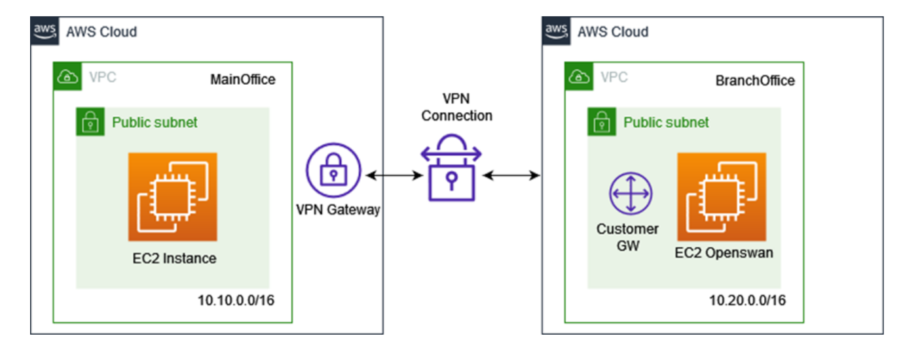

# M1877 - Seguridad en Cloud Computing.
# José Enrique Rodríguez González.
# PEC2: Gestión de riesgos en Cloud Computing: Un modelo, por defecto, distribuido

---

## Indice

- [Pesentación.](#presentación)
- [Pregunta 1.](#pregunta-1)
  - [Respuesta a Pregunta 1.](#respuesta-a-la-pregunta-1)
- [Pregunta 2.]()
  - [Respuesta a Pregunta 2.]()
- [Pregunta 3.]()
  - [Respuesta a Pregunta 3.a.]()
  - [Respuesta a Pregunta 3.b.](#respuesta-a-pregunta-3b)
- [Pregunta 4.](#pregunta-4)
  - [Respuesta a Pregunta 4.a.](#respuesta-a-pregunta-4a)
  - [Respuesta a Pregunta 4.b.](#respuesta-a-pregunta-4b)

--- 

## Presentación

Esta segunda PEC trata de detectar y estudiar las amenazas de los diferentes modelos de Cloud Computing, evaluar las responsabilidades de las partes, desarrollar los procesos de gestión de la seguridad y establecer mecanismos de mitigación para los incidentes de seguridad.  
Para cualquier duda o aclaración sobre el enunciado, podéis dirigiros al consultor responsable de
vuestra aula.

---

##  Pregunta 1.

***Equipos de Respuesta a Incidentes de Seguridad**

Como seguramente habéis podido comprobar dentro de los materiales, existe un RFC (http://www.ietf.org/rfc/rfc2350.txt) específico para equipos de respuesta que tiene como objetivo ofrecer a los usuarios de su ámbito de actuación información relacionada con sus actividades.

Utilizando este RFC, analizar el equipo de respuesta CERT-EU (https://cert.europa.eu) identificando el tipo, el porqué de su creación, a quien presta servicios, cuáles son los servicios que ofrece, tiempos en actividad, etc. Es importante destacar y justificar en que se caracteriza y exponer su misión,visión y valores.

## Respuesta a la pregunta 1.

El CERT-EU (Computer Emergency Response Team for the EU institutions, bodies and agencies) es un equipo de respuesta a incidentes de seguridad específico para las instituciones, organismos y agencias de la Unión Europea. Se basa en el RFC 2350, que establece un marco para la creación y operación de estos equipos, así como la información que deben proporcionar a los usuarios de su ámbito de actuación.

**Tipo y razón de su creación.**

El CERT-EU es un CSIRT (Computer Security Incident Response Team), que es un tipo de equipo de respuesta a incidentes de seguridad. Fue creado para proteger las infraestructuras de información y comunicaciones de las instituciones, organismos y agencias de la Unión Europea y para garantizar la seguridad de sus redes y sistemas de información.

**A quién presta servicios.**

El CERT-EU presta servicios a las instituciones, organismos y agencias de la Unión Europea, incluidos el Parlamento Europeo, el Consejo, la Comisión, la Corte de Justicia y el Banco Central Europeo, entre otros.

**Servicios que ofrece.**

El CERT-EU ofrece una variedad de servicios, que incluyen:

- Alertas y advertencias: proporciona información oportuna y precisa sobre amenazas y vulnerabilidades en la ciberseguridad.
- Gestión de incidentes: coordina la respuesta a incidentes de seguridad de la información en el ámbito de la Unión Europea.
- Análisis y evaluación de riesgos: identifica y evalúa los riesgos para la infraestructura de TI y las comunicaciones de las instituciones de la UE.
- Formación y concienciación: promueve la formación y concienciación en ciberseguridad y en la prevención de incidentes.
- Colaboración y coordinación: trabaja en estrecha colaboración con otros CERTs, organizaciones y expertos en seguridad de la información a nivel nacional e internacional.

**Tiempos en actividad**

El CERT-EU fue establecido en 2011 como una respuesta a la creciente preocupación por la seguridad de la información y las amenazas cibernéticas. Desde entonces, ha estado en funcionamiento y ha evolucionado para adaptarse a las cambiantes amenazas y necesidades de las instituciones de la UE.

**Misión, visión y valores**

Misión: La misión del CERT-EU es contribuir a la ciberseguridad de las instituciones, organismos y agencias de la Unión Europea, protegiendo sus infraestructuras de información y comunicaciones y asegurando la integridad, confidencialidad y disponibilidad de sus sistemas y datos.

Visión: El CERT-EU aspira a ser un centro de excelencia en ciberseguridad, ofreciendo servicios de calidad y cooperando con otros equipos de respuesta a incidentes y organizaciones a nivel nacional e internacional.

Valores: Los valores del CERT-EU incluyen la profesionalidad, la cooperación, la confidencialidad, la integridad y la transparencia. Estos valores reflejan su compromiso con la protección de la información y la infraestructura de la UE y con la construcción de una comunidad de seguridad de la información sólida y colaborativa.

**Conclusiones**

Por todo lo anteriormente expuesto en la presente pregunta se llega a las siguientes conclusiones.
- El CERT-EU es un equipo de respuesta a incidentes de seguridad.
  1. ***Centrado en proteger las infraestructuras de información y comunicaciones de las instituciones, organismos y agencias de la Unión Europea. Su misión es garantizar la ciberseguridad y proteger la integridad, confidencialidad y disponibilidad de los sistemas y datos de la UE.***
  2. ***La visión del CERT-EU es convertirse en un centro de excelencia en ciberseguridad, proporcionando servicios de alta calidad y colaborando con otros equipos de respuesta a incidentes y organizaciones a nivel nacional e internacional.***
  3. ***Los valores que guían al CERT-EU incluyen la profesionalidad, la cooperación, la confidencialidad, la integridad y la transparencia, reflejando su compromiso con la protección de la información y la infraestructura de la UE, así como con la construcción de una comunidad de seguridad de la información sólida y colaborativa.***

## Pregunta 2.

1. En este ejercicio se trabajará con la guía de puesta en marcha proporcionada por ENISA
(https://www.enisa.europa.eu/publications/how-to-set-up-csirt-and-soc).  El  ejercicio trata  de  elaborar un documento RFC-2350 de un nuevo equipo de respuesta a incidentes para dar servicio a una Universidad  presencial  con  una  comunidad  aproximada  de:
- I.  75.000  alumnos.
- II.  4.000  PDI's  (Personal  docente  e  investigador).
- III.  1.700  PAS  (Personal  de  administración  y  servicios).
En este apartado se tienen que identificar sobre la base de vuestra experiencia previa, a las  necesidades de estos tipos de comunidades y a los riesgos asociados a las redes que denominamos Campus, donde se ofrece conectividad y recursos de cálculo (aulas  informáticas  y equipos personales por PAS Y PDI) a toda la comunidad hacia redes académicas globales e Internet.
IMPORTANTE:  Fuera  de  la  redacción  del  RFC  se  tiene  que  confeccionar  previamente  un  DAFO para  justificar  los  servicios  que  se  recomienda  ofrecer  y  que  se  consideran  como  indispensables.

2. De los servicios ofrecidos por tu equipo de respuesta realiza un mapeo de las herramientas del CSIRT-KIT (https://csirt-kit.org/#services) que pueden ser de utilidad. Puede darse el caso que una herramienta aplique a varios servicios.

## Respuesta a la pregunta 2.1

Tal y como dice la nota del presente apartado, se procede a elaborar un analisis DAFO (Debilidades, Amenazas, Fortalezas y Oportunidades) para identificar los servicios indispensables que se deben ofrecer.

- ***Análisis DAFO:***

  - **Debilidades:**

    1. Diversidad de dispositivos y sistemas operativos utilizados por estudiantes, PDI y PAS.
    2. Falta de conocimientos de seguridad informática en la comunidad universitaria.
    3. Acceso a información confidencial y sensible por parte de diferentes miembros de la comunidad.
    4. Posibles brechas de seguridad en la infraestructura tecnológica.

  - **Amenazas:**

    1. Ataques de phishing dirigidos a miembros de la comunidad universitaria.
    2. Ransomware que afecta a sistemas críticos y datos de la Universidad.
    3. Ataques DDoS que interrumpen el acceso a servicios en línea y recursos académicos.
    4. Vulnerabilidades en aplicaciones y sistemas utilizados por la Universidad.

  - **Fortalezas:**

    1. Conexión a redes académicas globales que facilitan la colaboración y el intercambio de conocimientos.
    2. Disponibilidad de recursos de cálculo y conectividad para toda la comunidad.
    3. Personal docente e investigador con conocimientos en tecnología y ciberseguridad.
    4. Posibilidad de implementar políticas y procedimientos de seguridad en toda la Universidad.

  - **Oportunidades:**

    1. Formación en seguridad informática para la comunidad universitaria.
    2. Colaboración con otros equipos de respuesta a incidentes y organizaciones de ciberseguridad.
    3. Mejora continua de la infraestructura y políticas de seguridad de la Universidad.
    4. Implementación de nuevas tecnologías y sistemas de seguridad.

Con base en este análisis DAFO, se recomienda que el equipo de respuesta a incidentes de la Universidad ofrezca los siguientes servicios indispensables:

- Detección y respuesta a incidentes: Monitorear la red del campus y sistemas críticos para detectar posibles ataques o brechas de seguridad, y responder de manera rápida y efectiva.

- Formación y concienciación en seguridad informática: Desarrollar y ofrecer programas de formación y concienciación para estudiantes, PDI y PAS, con el fin de mejorar sus conocimientos y habilidades en seguridad informática.

- Análisis de vulnerabilidades y gestión de parches: Realizar análisis periódicos de vulnerabilidades en sistemas y aplicaciones de la Universidad, y gestionar la aplicación de parches y actualizaciones de seguridad.

- Gestión de riesgos y cumplimiento: Establecer y mantener políticas, procedimientos y controles de seguridad en la Universidad, y asegurar el cumplimiento de las normativas y estándares de seguridad aplicables.

- Colaboración y coordinación con otros equipos de respuesta a incidentes y organizaciones de ciberseguridad: Establecer alianzas y colaborar con otras instituciones y equipos de respuesta a incidentes para compartir información, recursos y buenas prácticas en ciberseguridad.

**Una vez identificados estos servicios indispensables, se puede proceder a redactar el documento RFC-2350.** Este documento se iniciará en la siguiente página.

# Documento RFC 2350

## 1. Introducción.

Este documento define el Equipo de Respuesta a Incidentes (CSIRT) de la Universidad, que se encarga de la gestión de incidentes de seguridad en la red del campus y sistemas de la Universidad. El CSIRT actúa como un punto central de contacto para reportar y coordinar la respuesta a incidentes de seguridad. Este documento se ajusta al formato de descripción de RFC 2350.

---

## 2. Datos de contacto.

- Nombre del equipo: CSIRT Universidad
- Dirección de correo electrónico: csirt@universidad.edu
- Teléfono: +1-123-456-7890
- Horario de operación: 24/7

---

## 3. Constitución del equipo.

El CSIRT Universidad está formado por personal especializado en ciberseguridad, con experiencia en detección y respuesta a incidentes, análisis de vulnerabilidades, gestión de riesgos y cumplimiento.

---

## 4.Área de responsabilidad.

El CSIRT Universidad es responsable de la red del campus y de todos los sistemas y servicios de TI de la Universidad, que incluyen:

- Red de campus y conectividad a Internet
- Sistemas de correo electrónico y comunicación
- Aplicaciones y servicios en línea
- Infraestructura de cálculo y almacenamiento
- Equipos y dispositivos de estudiantes, PDI y PAS

---

## 5. Servicios ofrecidos.

El CSIRT Universidad ofrece los siguientes servicios indispensables:

Detección y respuesta a incidentes
Formación y concienciación en seguridad informática
Análisis de vulnerabilidades y gestión de parches
Gestión de riesgos y cumplimiento
Colaboración y coordinación con otros equipos de respuesta a incidentes y organizaciones de ciberseguridad

---

## 6. Incidentes y puntos de contacto.

Para reportar un incidente de seguridad, comuníquese con el CSIRT Universidad a través de las siguientes vías:

- Dirección de correo electrónico: incidentes@csirt.universidad.edu
- Teléfono: +1-123-456-7890

---

## 7. Coordinación con otros equipos y organizaciones.

El CSIRT Universidad colabora activamente con otros equipos de respuesta a incidentes y organizaciones de ciberseguridad para compartir información, recursos y buenas prácticas en ciberseguridad. Esto incluye la participación en foros y grupos de trabajo, así como la colaboración en la respuesta a incidentes que afecten a múltiples instituciones.

---

## 8. Política de divulgación de información.

El CSIRT Universidad se compromete a proteger la privacidad y confidencialidad de la información relacionada con incidentes de seguridad. Solo se divulgará información sobre incidentes a terceros con el consentimiento del afectado o cuando sea necesario para cumplir con las leyes y regulaciones aplicables.

---

## 9. Actualización de este documento.

Este documento RFC 2350 se actualizará periódicamente para reflejar cambios en el CSIRT Universidad, sus servicios y políticas. La versión actualizada se publicará en el sitio web del CSIRT Universidad y se notificará a los miembros de la comunidad universitaria y a otros equipos de respuesta a incidentes relevantes.

---

## 10. Formación y recursos.

El CSIRT Universidad proporciona formación y recursos en seguridad informática para estudiantes, PDI y PAS, incluyendo:

- Talleres y seminarios sobre temas de ciberseguridad, como protección de contraseñas, detección de phishing y seguridad en redes sociales.
- Material de capacitación en línea, como tutoriales, videos y guías.
- Evaluaciones de seguridad periódicas para identificar áreas de mejora en conocimientos y habilidades de seguridad informática.

---

## 11. Procedimientos de respuesta a incidentes.

El CSIRT Universidad sigue un proceso estructurado de respuesta a incidentes, que incluye:

1. Identificación y reporte: El CSIRT recibe información sobre posibles incidentes de seguridad a través de sus puntos de contacto, monitoreo de la red y sistemas, o de otras fuentes confiables.
2. Análisis y clasificación: El CSIRT analiza la información del incidente y determina la naturaleza, alcance y severidad del mismo.
3. Contención y erradicación: El CSIRT trabaja con las partes afectadas para contener y erradicar la amenaza, protegiendo la información y sistemas involucrados.
4. Recuperación y restauración: El CSIRT ayuda a las partes afectadas en la recuperación y restauración de sistemas y servicios, asegurando la continuidad de las operaciones.
5. Lecciones aprendidas y mejora: El CSIRT revisa los incidentes y documenta las lecciones aprendidas, identificando oportunidades de mejora en la prevención, detección y respuesta a incidentes futuros.

---

## 12. Métricas y evaluación del rendimiento.

El CSIRT Universidad mide su rendimiento utilizando métricas clave, como:
- Número y tipo de incidentes de seguridad detectados y gestionados.
- Tiempo promedio de respuesta a incidentes, desde la identificación hasta la resolución.
- Satisfacción de los miembros de la comunidad universitaria con los servicios del CSIRT.
- Efectividad de las iniciativas de formación y concienciación en seguridad informática.
- Estas métricas se revisan periódicamente para evaluar la eficacia del CSIRT y determinar áreas de mejora.

---

## 13. Revisión y auditoría.

El CSIRT Universidad se somete a revisiones y auditorías internas y externas para garantizar la calidad y eficacia de sus servicios, políticas y procedimientos. Estas revisiones incluyen la evaluación de la capacidad del CSIRT para prevenir, detectar y responder a incidentes de seguridad, así como el cumplimiento con las normativas y estándares de seguridad aplicables.

---

## 14. Responsabilidades de la comunidad universitaria.

La comunidad universitaria desempeña un papel fundamental en la seguridad de la red del campus y de los sistemas y servicios de TI. Para apoyar los esfuerzos del CSIRT Universidad y mejorar la seguridad en general, se espera que los miembros de la comunidad universitaria:
- Reporten cualquier incidente de seguridad o actividad sospechosa al CSIRT de manera oportuna.
- Participen en las iniciativas de formación y concienciación en seguridad informática proporcionadas por el CSIRT.
- Cumplan con las políticas, procedimientos y controles de seguridad establecidos por la Universidad.
- Utilicen prácticas seguras en el uso de dispositivos, sistemas y servicios de TI.

---

## 15. Comunicación y divulgación de incidentes de seguridad.

El CSIRT Universidad se compromete a mantener informada a la comunidad universitaria sobre incidentes de seguridad y actividades relevantes. Esto incluye la divulgación de información sobre incidentes de seguridad que afecten a la Universidad, siempre que no comprometa la privacidad o la confidencialidad de la información involucrada.

La comunicación de incidentes de seguridad puede incluir:

- Alertas y notificaciones enviadas por correo electrónico a la comunidad universitaria.
- Publicaciones en el sitio web del CSIRT y redes sociales.
- Informes periódicos sobre incidentes de seguridad y tendencias en ciberseguridad.

---

## 16. Planificación y preparación para incidentes.

El CSIRT Universidad trabaja continuamente en la planificación y preparación para incidentes de seguridad. Esto incluye la revisión y actualización de políticas y procedimientos de respuesta a incidentes, la realización de ejercicios y simulacros, y la identificación de recursos y herramientas necesarios para responder de manera efectiva a incidentes de seguridad.

---

## 17. Apoyo a la investigación y desarrollo en ciberseguridad.

El CSIRT Universidad colabora con el personal docente e investigador en proyectos de investigación y desarrollo en ciberseguridad. Esto incluye la identificación de oportunidades para mejorar la seguridad de la red del campus y de los sistemas y servicios de TI, así como la promoción de la innovación en ciberseguridad.

---

## 18. Iniciativas de colaboración interinstitucional.

El CSIRT Universidad busca activamente establecer y mantener relaciones de colaboración con otros equipos de respuesta a incidentes y organizaciones de ciberseguridad en el ámbito académico y más allá. Estas colaboraciones pueden incluir:
- Participación en foros y eventos de ciberseguridad.
- Intercambio de información y experiencias sobre amenazas, vulnerabilidades y mejores prácticas en ciberseguridad.
- Cooperación en proyectos de investigación y desarrollo en ciberseguridad.
- Apoyo mutuo en la respuesta a incidentes que afecten a múltiples instituciones.

---

## 19. Iniciativas de concienciación y divulgación.

El CSIRT Universidad se esfuerza por aumentar la concienciación sobre la importancia de la ciberseguridad en la comunidad universitaria y más allá. Para lograr esto, el CSIRT organiza y participa en diversas iniciativas de concienciación y divulgación, como:
- Charlas y conferencias sobre ciberseguridad dirigidas a estudiantes, PDI y PAS.
- Campañas de concienciación en redes sociales y otros medios de comunicación.
- Participación en eventos de ciberseguridad organizados por otras instituciones y organizaciones.

---

## 20. Desarrollo de habilidades y capacitación del personal del CSIRT.
El CSIRT Universidad reconoce la importancia de contar con personal altamente capacitado y con habilidades actualizadas en ciberseguridad. Para asegurar esto, el CSIRT proporciona oportunidades de desarrollo profesional y capacitación a sus miembros, incluyendo:

Acceso a cursos y certificaciones en ciberseguridad.
Asistencia a conferencias y eventos de ciberseguridad.
Participación en ejercicios y simulacros de respuesta a incidentes.

---

## 21. Evaluación de la madurez del CSIRT.

El CSIRT Universidad realiza evaluaciones periódicas de su madurez y capacidad para abordar los desafíos de ciberseguridad en constante evolución. Estas evaluaciones pueden incluir:
- Autoevaluaciones basadas en marcos de madurez de CSIRT reconocidos, como el modelo de madurez de CERT/CC.
- Evaluaciones externas realizadas por expertos en ciberseguridad o instituciones asociadas.
- Comparaciones con otros equipos de respuesta a incidentes y organizaciones de ciberseguridad.

---

## 22. Mejora continua.

El CSIRT Universidad se compromete a mejorar continuamente sus servicios, políticas y procedimientos en respuesta a las lecciones aprendidas de incidentes de seguridad, evaluaciones de madurez y retroalimentación de la comunidad universitaria. Esto incluye la implementación de cambios y mejoras basadas en la evidencia, así como la adaptación a las tendencias emergentes en ciberseguridad y tecnología.

---

## 23. Futuras direcciones y desafíos

El CSIRT Universidad reconoce que el panorama de ciberseguridad está en constante evolución y se enfrentará a nuevos desafíos en el futuro. Algunas de las áreas clave en las que el CSIRT planea centrarse incluyen:
- Abordar las implicaciones de seguridad de tecnologías emergentes, como la inteligencia artificial, el Internet de las cosas y la computación cuántica.
- Ampliar y mejorar la colaboración con otros equipos de respuesta a incidentes y organizaciones de ciberseguridad a nivel nacional e internacional.
- Integrar enfoques de inteligencia de amenazas para anticipar y prevenir incidentes de seguridad antes de que ocurran.
- Fortalecer la resiliencia de la infraestructura de TI de la Universidad frente a ataques cibernéticos cada vez más sofisticados y persistentes.
- Asegurar la privacidad y la protección de datos en un entorno de creciente interconexión y dependencia de sistemas digitales.
- Desarrollar y mantener un talento altamente capacitado y diverso dentro del CSIRT para enfrentar los desafíos futuros en ciberseguridad.

---

## 24. Agradecimientos.

El CSIRT Universidad agradece el apoyo y la colaboración de la comunidad universitaria, así como de otras instituciones y equipos de respuesta a incidentes en la promoción y mejora de la ciberseguridad. La cooperación y el intercambio de conocimientos y recursos son fundamentales para enfrentar los desafíos en un entorno cibernético en constante evolución.

---

## 25. Contacto e información adicional.
Para obtener más información sobre el CSIRT Universidad, sus servicios y actividades, o para reportar un incidente de seguridad, comuníquese con nosotros a través de los siguientes medios:

- Correo electrónico: csirt@universidad.edu
- Teléfono: +11-2222-3333
- Sitio web: www.universidad.edu/csirt
- Redes sociales: Twitter (@CSIRT_Universidad), Facebook (CSIRT Universidad)

También puede encontrar información adicional sobre políticas, procedimientos y recursos de seguridad informática en el sitio web del CSIRT Universidad.

---

## 26. Revisiones y actualizaciones del documento

Este documento RFC-2350 está sujeto a revisiones y actualizaciones periódicas para garantizar que refleje de manera precisa los servicios, políticas y procedimientos del CSIRT Universidad. Las actualizaciones también pueden incluir cambios en respuesta a la retroalimentación de la comunidad universitaria y las lecciones aprendidas de incidentes de seguridad.

***Fecha de la última revisión: 19 de abril de 2023***

---

## 27. Referencias.

- ENISA (2021). How to set up a CSIRT and a SOC: Good Practice Guide. European Union Agency for Cybersecurity. https://www.enisa.europa.eu/publications/how-to-set-up-csirt-and-soc
- RFC 2350 (1998). Expectations for Computer Security Incident Response. Network Working Group. https://tools.ietf.org/html/rfc2350
- CERT/CC (2019). CSIRT Development and Evaluation: Capability Maturity Model Integration (CMMI). Carnegie Mellon University. https://resources.sei.cmu.edu/library/asset-view.cfm?assetid=536904

---

## 28. Aviso legal

Este documento RFC-2350 se proporciona "tal cual" y tiene como objetivo informar a la comunidad universitaria y a otras partes interesadas sobre los servicios y políticas del CSIRT Universidad. La información contenida en este documento está sujeta a cambios sin previo aviso y no se garantiza su precisión o integridad en todo momento. La Universidad y el CSIRT no se hacen responsables de los errores, omisiones o daños resultantes del uso de la información contenida en este documento.

---

## 29. Contribuciones y retroalimentación.

El CSIRT Universidad valora las contribuciones y la retroalimentación de la comunidad universitaria y de otras partes interesadas. Si desea proporcionar sugerencias, comentarios o identificar áreas de mejora en relación con este documento RFC-2350, los servicios o las políticas del CSIRT, no dude en ponerse en contacto con nosotros a través de los medios de comunicación mencionados en el [punto 25](#25-contacto-e-información-adicional).

---

## 30. Cierre del Documento RFC 2350.

Este documento RFC-2350 representa un esfuerzo por mantener informada a la comunidad universitaria y a otras partes interesadas sobre los servicios y políticas del CSIRT Universidad. Esperamos que este documento sea útil y sirva como un recurso valioso en la promoción de la ciberseguridad y la resiliencia de nuestra comunidad. Gracias por su interés y apoyo en la mejora de la ciberseguridad en nuestra Universidad.

---

**Conclusiones**

En conclusión, el CSIRT Universidad desempeña un papel esencial en la protección de la información y los recursos de la Universidad y su comunidad en un entorno cibernético en constante evolución. A través de la implementación de servicios como la prevención, detección y respuesta a incidentes de seguridad, la formación y concienciación en seguridad informática y la colaboración con otros equipos de respuesta a incidentes y organizaciones de ciberseguridad, el CSIRT contribuye significativamente a la seguridad y resiliencia de la comunidad universitaria.

Además, este documento RFC-2350, basado en un análisis DAFO completo, establece claramente las debilidades, amenazas, fortalezas y oportunidades que enfrenta la Universidad en términos de ciberseguridad. Esto permite al CSIRT desarrollar e implementar políticas y procedimientos efectivos que aborden estos desafíos y mitiguen los riesgos asociados.

La adaptación a las tendencias emergentes en ciberseguridad y tecnología, junto con un enfoque en la mejora continua y la retroalimentación de la comunidad universitaria, garantizará que el CSIRT siga siendo un componente fundamental en la protección de la Universidad y sus miembros en el futuro. Por último, la colaboración y el intercambio de conocimientos entre el CSIRT y otras instituciones y equipos de respuesta a incidentes permitirán a la Universidad enfrentar de manera efectiva los desafíos futuros en ciberseguridad y mantener un entorno seguro y resiliente para todos los miembros de su comunidad.

----

## Respuesta a la pregunta 2.2.

---

## Pregunta 3.

La oficina principal de vuestra organización ha completado la migración a la nube pública de *Amazon Web Services* (AWS), pero una sucursal todavía utiliza un centro de datos (CPD) privado y remoto. En este laboratorio, tendréis que configurar una conexión VPN segura entre los dos lugares (Site-to-Site) que permita que los servidores de las sucursales se conecten a los datos almacenados en el VPC de la oficina principal en la nube de AWS. La conexión tiene que ser
segura y utilizar la conexión a Internet que ya existe en el centro de datos de la sucursal.

Para realizar el ejercicio se usará un laboratorio de la UOC en AWS donde tendréis pre creados dos VPC uno que representará la oficina principal (`MainOffice`) y un segundo que simulará el CPD remoto (`BranchOffice`).

Para facilitaros el despliegue de la infraestructura en AWS adjunto disponéis de un pequeño guión (Anexo 1) con los principales pasos que tenéis que ir realizando para completar el laboratorio.

Una vez finalizado con el despliegue, contestar a las siguientes preguntas:

1. Elaborar un informe con el procedimiento seguido para realizar el laboratorio con los correspondientes capturas de pantalla para cada uno de los pasos y donde se verifique el correcto funcionamiento de la VPN, mostrando como inicialmente no existía conectividad entre las dos instancias de EC2.
2. En el ejercicio anterior, habéis utilizado un Security Group para cada instancia de EC2 se podría haber utilizado también una Network ACL? ¿Qué diferencias existen entre un Security Group y una Network ACL en AWS?
3. Qué servicio o servicios de AWS podemos utilizar para auditar toda la actividad de nuestro VPC? Puedes poner un ejemplo con la infraestructura desplegada.
4. ¿Qué servicio de AWS podemos utilizar para realizar copias de seguridad de nuestros servidores EC2?
5. Para acceder a la gestión de las máquinas EC2 en el laboratorio, hemos utilizado el protocolo SSH abierto a Internet. Propón una opción más segura utilizando algunos de los servicios que ofrece AWS
6. Describe la funcionalidad de los siguientes servicios AWS y pone un ejemplo de cómo o porqué utilizarías este servicio en el caso de uso planteado.
  - Amazon GuardDuty
  - AWS WAF
  - Amazon Detective
  - AWS Config
  - AWS Network Firewall

## Pregunta 4.

La gestión de costes de la nube implica encontrar modos rentables de maximizar la eficiencia y el uso de la nube. Los costes de la nube incluyen las instancias de máquinas virtuales, la memoria, el almacenamiento, el tráfico de red, el soporte y las licencias de software.

1. Dada la infraestructura del laboratorio de la pregunta 3, cómo evaluarías su coste, identificando todos aquellos elementos que tienen un coste asociado, suponiendo que estuviera 24x7 activa. Como mínimo es necesario evaluar el coste de la conexión VPN, las transferencias de entrada y salida de datos y las instancias EC2 (suponiendo que no fueran t2.micro). Para realizar el ejercicio puedes ayudarte de la herramienta AWS Pricing Calculator https://calculator.aws

2. Describe cuál sería el orden de apagado de los recursos y las operaciones a realizar para el desmantelamiento correcto de la infraestructura del laboratorio de la pregunta 3.

