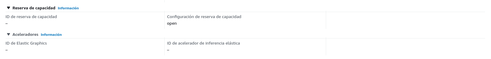

# M1877 - Seguridad en Cloud Computing.
# José Enrique Rodríguez González.
# PEC2: Gestión de riesgos en Cloud Computing: Un modelo, por defecto, distribuido

## Indice

- [Presentación.](#presentación)
- [Pregunta 1.](#pregunta-1)
  - [Respuesta a Pregunta 1.](#respuesta-a-la-pregunta-1)
- [Pregunta 2.](#pregunta-2)
  - [Respuesta a Pregunta 2.1.](#respuesta-a-la-pregunta-21)
  - [Respuesta a la pregunta 2.2.](#respuesta-a-la-pregunta-22)
- [Pregunta 3.](#pregunta-3)
  - [Introducción a la pregunta 3.](#introducción-a-la-pregunta-3)
  - [Respuesta a Pregunta 3.1.](#respuesta-a-la-pregunta-31)
  - [Respuesta a Pregunta 3.2.](#respuesta-a-la-pregunta-32)
  - [Respuesta a Pregunta 3.3.](#respuesta-a-la-pregunta-33)
  - [Respuesta a Pregunta 3.4.](#respuesta-a-la-pregunta-34)
  - [Respuesta a Pregunta 3.5.](#respuesta-a-la-pregunta-35)
  - [Respuesta a Pregunta 3.6.](#respuesta-a-la-pregunta-36)
- [Pregunta 4.](#pregunta-4)
  - [Respuesta a Pregunta 4.1.](#respuesta-a-la-pregunta-41)
  - [Respuesta a Pregunta 4.2.](#respuesta-a-la-pregunta-42)

---

## Presentación

Esta segunda PEC trata de detectar y estudiar las amenazas de los diferentes modelos de Cloud Computing, evaluar las responsabilidades de las partes, desarrollar los procesos de gestión de la seguridad y establecer mecanismos de mitigación para los incidentes de seguridad.  
Para cualquier duda o aclaración sobre el enunciado, podéis dirigiros al consultor responsable de
vuestra aula.

---

      

##  Pregunta 1.

***Equipos de Respuesta a Incidentes de Seguridad**

Como seguramente habéis podido comprobar dentro de los materiales, existe un RFC (http://www.ietf.org/rfc/rfc2350.txt) específico para equipos de respuesta que tiene como objetivo ofrecer a los usuarios de su ámbito de actuación información relacionada con sus actividades.

Utilizando este RFC, analizar el equipo de respuesta CERT-EU (https://cert.europa.eu) identificando el tipo, el porqué de su creación, a quien presta servicios, cuáles son los servicios que ofrece, tiempos en actividad, etc. Es importante destacar y justificar en que se caracteriza y exponer su misión,visión y valores.

---

                                  

## Respuesta a la pregunta 1.

El CERT-EU (Computer Emergency Response Team for the EU institutions, bodies and agencies) es un equipo de respuesta a incidentes de seguridad específico para las instituciones, organismos y agencias de la Unión Europea. Se basa en el RFC 2350, que establece un marco para la creación y operación de estos equipos, así como la información que deben proporcionar a los usuarios de su ámbito de actuación.

**Tipo y razón de su creación.**

El CERT-EU es un CSIRT (Computer Security Incident Response Team), que es un tipo de equipo de respuesta a incidentes de seguridad. Fue creado para proteger las infraestructuras de información y comunicaciones de las instituciones, organismos y agencias de la Unión Europea y para garantizar la seguridad de sus redes y sistemas de información.

**A quién presta servicios.**

El CERT-EU presta servicios a las instituciones, organismos y agencias de la Unión Europea, incluidos el Parlamento Europeo, el Consejo, la Comisión, la Corte de Justicia y el Banco Central Europeo, entre otros.

**Servicios que ofrece.**

El CERT-EU ofrece una variedad de servicios, que incluyen:

- Alertas y advertencias: proporciona información oportuna y precisa sobre amenazas y vulnerabilidades en la ciberseguridad.
- Gestión de incidentes: coordina la respuesta a incidentes de seguridad de la información en el ámbito de la Unión Europea.
- Análisis y evaluación de riesgos: identifica y evalúa los riesgos para la infraestructura de TI y las comunicaciones de las instituciones de la UE.
- Formación y concienciación: promueve la formación y concienciación en ciberseguridad y en la prevención de incidentes.
- Colaboración y coordinación: trabaja en estrecha colaboración con otros CERTs, organizaciones y expertos en seguridad de la información a nivel nacional e internacional.

**Tiempos en actividad**

El CERT-EU fue establecido en 2011 como una respuesta a la creciente preocupación por la seguridad de la información y las amenazas cibernéticas. Desde entonces, ha estado en funcionamiento y ha evolucionado para adaptarse a las cambiantes amenazas y necesidades de las instituciones de la UE.

**Misión, visión y valores**

Misión: La misión del CERT-EU es contribuir a la ciberseguridad de las instituciones, organismos y agencias de la Unión Europea, protegiendo sus infraestructuras de información y comunicaciones y asegurando la integridad, confidencialidad y disponibilidad de sus sistemas y datos.

Visión: El CERT-EU aspira a ser un centro de excelencia en ciberseguridad, ofreciendo servicios de calidad y cooperando con otros equipos de respuesta a incidentes y organizaciones a nivel nacional e internacional.

Valores: Los valores del CERT-EU incluyen la profesionalidad, la cooperación, la confidencialidad, la integridad y la transparencia. Estos valores reflejan su compromiso con la protección de la información y la infraestructura de la UE y con la construcción de una comunidad de seguridad de la información sólida y colaborativa.

**Conclusiones**

Por todo lo anteriormente expuesto en la presente pregunta se llega a las siguientes conclusiones.
- El CERT-EU es un equipo de respuesta a incidentes de seguridad.
  1. ***Centrado en proteger las infraestructuras de información y comunicaciones de las instituciones, organismos y agencias de la Unión Europea. Su misión es garantizar la ciberseguridad y proteger la integridad, confidencialidad y disponibilidad de los sistemas y datos de la UE.***
  2. ***La visión del CERT-EU es convertirse en un centro de excelencia en ciberseguridad, proporcionando servicios de alta calidad y colaborando con otros equipos de respuesta a incidentes y organizaciones a nivel nacional e internacional.***
  3. ***Los valores que guían al CERT-EU incluyen la profesionalidad, la cooperación, la confidencialidad, la integridad y la transparencia, reflejando su compromiso con la protección de la información y la infraestructura de la UE, así como con la construcción de una comunidad de seguridad de la información sólida y colaborativa.***

---

                          

## Pregunta 2.

1. En este ejercicio se trabajará con la guía de puesta en marcha proporcionada por ENISA
(https://www.enisa.europa.eu/publications/how-to-set-up-csirt-and-soc).  El  ejercicio trata  de  elaborar un documento RFC-2350 de un nuevo equipo de respuesta a incidentes para dar servicio a una Universidad  presencial  con  una  comunidad  aproximada  de:
- I.  75.000  alumnos.
- II.  4.000  PDI's  (Personal  docente  e  investigador).
- III.  1.700  PAS  (Personal  de  administración  y  servicios).
En este apartado se tienen que identificar sobre la base de vuestra experiencia previa, a las  necesidades de estos tipos de comunidades y a los riesgos asociados a las redes que denominamos Campus, donde se ofrece conectividad y recursos de cálculo (aulas  informáticas  y equipos personales por PAS Y PDI) a toda la comunidad hacia redes académicas globales e Internet.
IMPORTANTE:  Fuera  de  la  redacción  del  RFC  se  tiene  que  confeccionar  previamente  un  DAFO para  justificar  los  servicios  que  se  recomienda  ofrecer  y  que  se  consideran  como  indispensables.

2. De los servicios ofrecidos por tu equipo de respuesta realiza un mapeo de las herramientas del CSIRT-KIT (https://csirt-kit.org/#services) que pueden ser de utilidad. Puede darse el caso que una herramienta aplique a varios servicios.

---

                          

## Respuesta a la pregunta 2.1

Tal y como dice la nota del presente apartado, se procede a elaborar un análisis DAFO (Debilidades, Amenazas, Fortalezas y Oportunidades) para identificar los servicios indispensables que se deben ofrecer.

- ***Análisis DAFO:***

  - **Debilidades:**

    1. Diversidad de dispositivos y sistemas operativos utilizados por estudiantes, PDI y PAS.
    2. Falta de conocimientos de seguridad informática en la comunidad universitaria.
    3. Acceso a información confidencial y sensible por parte de diferentes miembros de la comunidad.
    4. Posibles brechas de seguridad en la infraestructura tecnológica.

  - **Amenazas:**

    1. Ataques de phishing dirigidos a miembros de la comunidad universitaria.
    2. Ransomware que afecta a sistemas críticos y datos de la Universidad.
    3. Ataques DDoS que interrumpen el acceso a servicios en línea y recursos académicos.
    4. Vulnerabilidades en aplicaciones y sistemas utilizados por la Universidad.

  - **Fortalezas:**

    1. Conexión a redes académicas globales que facilitan la colaboración y el intercambio de conocimientos.
    2. Disponibilidad de recursos de cálculo y conectividad para toda la comunidad.
    3. Personal docente e investigador con conocimientos en tecnología y ciberseguridad.
    4. Posibilidad de implementar políticas y procedimientos de seguridad en toda la Universidad.

  - **Oportunidades:**

    1. Formación en seguridad informática para la comunidad universitaria.
    2. Colaboración con otros equipos de respuesta a incidentes y organizaciones de ciberseguridad.
    3. Mejora continua de la infraestructura y políticas de seguridad de la Universidad.
    4. Implementación de nuevas tecnologías y sistemas de seguridad.

Con base en este análisis DAFO, se recomienda que el equipo de respuesta a incidentes de la Universidad ofrezca los siguientes servicios indispensables:

- Detección y respuesta a incidentes: Monitorear la red del campus y sistemas críticos para detectar posibles ataques o brechas de seguridad, y responder de manera rápida y efectiva.

- Formación y concienciación en seguridad informática: Desarrollar y ofrecer programas de formación y concienciación para estudiantes, PDI y PAS, con el fin de mejorar sus conocimientos y habilidades en seguridad informática.

- Análisis de vulnerabilidades y gestión de parches: Realizar análisis periódicos de vulnerabilidades en sistemas y aplicaciones de la Universidad, y gestionar la aplicación de parches y actualizaciones de seguridad.

- Gestión de riesgos y cumplimiento: Establecer y mantener políticas, procedimientos y controles de seguridad en la Universidad, y asegurar el cumplimiento de las normativas y estándares de seguridad aplicables.

- Colaboración y coordinación con otros equipos de respuesta a incidentes y organizaciones de ciberseguridad: Establecer alianzas y colaborar con otras instituciones y equipos de respuesta a incidentes para compartir información, recursos y buenas prácticas en ciberseguridad.

**Una vez identificados estos servicios indispensables, se puede proceder a redactar el documento RFC-2350.** Este documento se iniciará en la siguiente página.

                                   

# Documento RFC 2350

## 1. Introducción.

Este documento define el Equipo de Respuesta a Incidentes (CSIRT) de la Universidad, que se encarga de la gestión de incidentes de seguridad en la red del campus y sistemas de la Universidad. El CSIRT actúa como un punto central de contacto para reportar y coordinar la respuesta a incidentes de seguridad. Este documento se ajusta al formato de descripción de RFC 2350.

---

## 2. Datos de contacto.

- Nombre del equipo: CSIRT Universidad
- Dirección de correo electrónico: csirt@universidad.edu
- Teléfono: +1-123-456-7890
- Horario de operación: 24/7

---

## 3. Constitución del equipo.

El CSIRT Universidad está formado por personal especializado en ciberseguridad, con experiencia en detección y respuesta a incidentes, análisis de vulnerabilidades, gestión de riesgos y cumplimiento.

---

## 4.Área de responsabilidad.

El CSIRT Universidad es responsable de la red del campus y de todos los sistemas y servicios de TI de la Universidad, que incluyen:

- Red de campus y conectividad a Internet
- Sistemas de correo electrónico y comunicación
- Aplicaciones y servicios en línea
- Infraestructura de cálculo y almacenamiento
- Equipos y dispositivos de estudiantes, PDI y PAS

---

## 5. Servicios ofrecidos.

El CSIRT Universidad ofrece los siguientes servicios indispensables:

Detección y respuesta a incidentes
Formación y concienciación en seguridad informática
Análisis de vulnerabilidades y gestión de parches
Gestión de riesgos y cumplimiento
Colaboración y coordinación con otros equipos de respuesta a incidentes y organizaciones de ciberseguridad

---

    

## 6. Incidentes y puntos de contacto.

Para reportar un incidente de seguridad, comuníquese con el CSIRT Universidad a través de las siguientes vías:

- Dirección de correo electrónico: incidentes@csirt.universidad.edu
- Teléfono: +1-123-456-7890

---

## 7. Coordinación con otros equipos y organizaciones.

El CSIRT Universidad colabora activamente con otros equipos de respuesta a incidentes y organizaciones de ciberseguridad para compartir información, recursos y buenas prácticas en ciberseguridad. Esto incluye la participación en foros y grupos de trabajo, así como la colaboración en la respuesta a incidentes que afecten a múltiples instituciones.

---

## 8. Política de divulgación de información.

El CSIRT Universidad se compromete a proteger la privacidad y confidencialidad de la información relacionada con incidentes de seguridad. Solo se divulgará información sobre incidentes a terceros con el consentimiento del afectado o cuando sea necesario para cumplir con las leyes y regulaciones aplicables.

---

## 9. Actualización de este documento.

Este documento RFC 2350 se actualizará periódicamente para reflejar cambios en el CSIRT Universidad, sus servicios y políticas. La versión actualizada se publicará en el sitio web del CSIRT Universidad y se notificará a los miembros de la comunidad universitaria y a otros equipos de respuesta a incidentes relevantes.

---

## 10. Formación y recursos.

El CSIRT Universidad proporciona formación y recursos en seguridad informática para estudiantes, PDI y PAS, incluyendo:

- Talleres y seminarios sobre temas de ciberseguridad, como protección de contraseñas, detección de phishing y seguridad en redes sociales.
- Material de capacitación en línea, como tutoriales, videos y guías.
- Evaluaciones de seguridad periódicas para identificar áreas de mejora en conocimientos y habilidades de seguridad informática.

---

      

## 11. Procedimientos de respuesta a incidentes.

El CSIRT Universidad sigue un proceso estructurado de respuesta a incidentes, que incluye:

1. Identificación y reporte: El CSIRT recibe información sobre posibles incidentes de seguridad a través de sus puntos de contacto, monitoreo de la red y sistemas, o de otras fuentes confiables.
2. Análisis y clasificación: El CSIRT analiza la información del incidente y determina la naturaleza, alcance y severidad del mismo.
3. Contención y erradicación: El CSIRT trabaja con las partes afectadas para contener y erradicar la amenaza, protegiendo la información y sistemas involucrados.
4. Recuperación y restauración: El CSIRT ayuda a las partes afectadas en la recuperación y restauración de sistemas y servicios, asegurando la continuidad de las operaciones.
5. Lecciones aprendidas y mejora: El CSIRT revisa los incidentes y documenta las lecciones aprendidas, identificando oportunidades de mejora en la prevención, detección y respuesta a incidentes futuros.

---

## 12. Métricas y evaluación del rendimiento.

El CSIRT Universidad mide su rendimiento utilizando métricas clave, como:
- Número y tipo de incidentes de seguridad detectados y gestionados.
- Tiempo promedio de respuesta a incidentes, desde la identificación hasta la resolución.
- Satisfacción de los miembros de la comunidad universitaria con los servicios del CSIRT.
- Efectividad de las iniciativas de formación y concienciación en seguridad informática.
- Estas métricas se revisan periódicamente para evaluar la eficacia del CSIRT y determinar áreas de mejora.

---

## 13. Revisión y auditoría.

El CSIRT Universidad se somete a revisiones y auditorías internas y externas para garantizar la calidad y eficacia de sus servicios, políticas y procedimientos. Estas revisiones incluyen la evaluación de la capacidad del CSIRT para prevenir, detectar y responder a incidentes de seguridad, así como el cumplimiento con las normativas y estándares de seguridad aplicables.

---

## 14. Responsabilidades de la comunidad universitaria.

La comunidad universitaria desempeña un papel fundamental en la seguridad de la red del campus y de los sistemas y servicios de TI. Para apoyar los esfuerzos del CSIRT Universidad y mejorar la seguridad en general, se espera que los miembros de la comunidad universitaria:
- Reporten cualquier incidente de seguridad o actividad sospechosa al CSIRT de manera oportuna.
- Participen en las iniciativas de formación y concienciación en seguridad informática proporcionadas por el CSIRT.
- Cumplan con las políticas, procedimientos y controles de seguridad establecidos por la Universidad.
- Utilicen prácticas seguras en el uso de dispositivos, sistemas y servicios de TI.

---

 

## 15. Comunicación y divulgación de incidentes de seguridad.

El CSIRT Universidad se compromete a mantener informada a la comunidad universitaria sobre incidentes de seguridad y actividades relevantes. Esto incluye la divulgación de información sobre incidentes de seguridad que afecten a la Universidad, siempre que no comprometa la privacidad o la confidencialidad de la información involucrada.

La comunicación de incidentes de seguridad puede incluir:

- Alertas y notificaciones enviadas por correo electrónico a la comunidad universitaria.
- Publicaciones en el sitio web del CSIRT y redes sociales.
- Informes periódicos sobre incidentes de seguridad y tendencias en ciberseguridad.

---

## 16. Planificación y preparación para incidentes.

El CSIRT Universidad trabaja continuamente en la planificación y preparación para incidentes de seguridad. Esto incluye la revisión y actualización de políticas y procedimientos de respuesta a incidentes, la realización de ejercicios y simulacros, y la identificación de recursos y herramientas necesarios para responder de manera efectiva a incidentes de seguridad.

---

## 17. Apoyo a la investigación y desarrollo en ciberseguridad.

El CSIRT Universidad colabora con el personal docente e investigador en proyectos de investigación y desarrollo en ciberseguridad. Esto incluye la identificación de oportunidades para mejorar la seguridad de la red del campus y de los sistemas y servicios de TI, así como la promoción de la innovación en ciberseguridad.

---

## 18. Iniciativas de colaboración interinstitucional.

El CSIRT Universidad busca activamente establecer y mantener relaciones de colaboración con otros equipos de respuesta a incidentes y organizaciones de ciberseguridad en el ámbito académico y más allá. Estas colaboraciones pueden incluir:
- Participación en foros y eventos de ciberseguridad.
- Intercambio de información y experiencias sobre amenazas, vulnerabilidades y mejores prácticas en ciberseguridad.
- Cooperación en proyectos de investigación y desarrollo en ciberseguridad.
- Apoyo mutuo en la respuesta a incidentes que afecten a múltiples instituciones.

---

       

## 19. Iniciativas de concienciación y divulgación.

El CSIRT Universidad se esfuerza por aumentar la concienciación sobre la importancia de la ciberseguridad en la comunidad universitaria y más allá. Para lograr esto, el CSIRT organiza y participa en diversas iniciativas de concienciación y divulgación, como:
- Charlas y conferencias sobre ciberseguridad dirigidas a estudiantes, PDI y PAS.
- Campañas de concienciación en redes sociales y otros medios de comunicación.
- Participación en eventos de ciberseguridad organizados por otras instituciones y organizaciones.

---

## 20. Desarrollo de habilidades y capacitación del personal del CSIRT.
El CSIRT Universidad reconoce la importancia de contar con personal altamente capacitado y con habilidades actualizadas en ciberseguridad. Para asegurar esto, el CSIRT proporciona oportunidades de desarrollo profesional y capacitación a sus miembros, incluyendo:

Acceso a cursos y certificaciones en ciberseguridad.
Asistencia a conferencias y eventos de ciberseguridad.
Participación en ejercicios y simulacros de respuesta a incidentes.

---

## 21. Evaluación de la madurez del CSIRT.

El CSIRT Universidad realiza evaluaciones periódicas de su madurez y capacidad para abordar los desafíos de ciberseguridad en constante evolución. Estas evaluaciones pueden incluir:
- Autoevaluaciones basadas en marcos de madurez de CSIRT reconocidos, como el modelo de madurez de CERT/CC.
- Evaluaciones externas realizadas por expertos en ciberseguridad o instituciones asociadas.
- Comparaciones con otros equipos de respuesta a incidentes y organizaciones de ciberseguridad.

---

## 22. Mejora continua.

El CSIRT Universidad se compromete a mejorar continuamente sus servicios, políticas y procedimientos en respuesta a las lecciones aprendidas de incidentes de seguridad, evaluaciones de madurez y retroalimentación de la comunidad universitaria. Esto incluye la implementación de cambios y mejoras basadas en la evidencia, así como la adaptación a las tendencias emergentes en ciberseguridad y tecnología.

---

        

## 23. Futuras direcciones y desafíos

El CSIRT Universidad reconoce que el panorama de ciberseguridad está en constante evolución y se enfrentará a nuevos desafíos en el futuro. Algunas de las áreas clave en las que el CSIRT planea centrarse incluyen:
- Abordar las implicaciones de seguridad de tecnologías emergentes, como la inteligencia artificial, el Internet de las cosas y la computación cuántica.
- Ampliar y mejorar la colaboración con otros equipos de respuesta a incidentes y organizaciones de ciberseguridad a nivel nacional e internacional.
- Integrar enfoques de inteligencia de amenazas para anticipar y prevenir incidentes de seguridad antes de que ocurran.
- Fortalecer la resiliencia de la infraestructura de TI de la Universidad frente a ataques cibernéticos cada vez más sofisticados y persistentes.
- Asegurar la privacidad y la protección de datos en un entorno de creciente interconexión y dependencia de sistemas digitales.
- Desarrollar y mantener un talento altamente capacitado y diverso dentro del CSIRT para enfrentar los desafíos futuros en ciberseguridad.

---

## 24. Agradecimientos.

El CSIRT Universidad agradece el apoyo y la colaboración de la comunidad universitaria, así como de otras instituciones y equipos de respuesta a incidentes en la promoción y mejora de la ciberseguridad. La cooperación y el intercambio de conocimientos y recursos son fundamentales para enfrentar los desafíos en un entorno cibernético en constante evolución.

---

## 25. Contacto e información adicional.
Para obtener más información sobre el CSIRT Universidad, sus servicios y actividades, o para reportar un incidente de seguridad, comuníquese con nosotros a través de los siguientes medios:

- Correo electrónico: csirt@universidad.edu
- Teléfono: +11-2222-3333
- Sitio web: www.universidad.edu/csirt
- Redes sociales: Twitter (@CSIRT_Universidad), Facebook (CSIRT Universidad)

También puede encontrar información adicional sobre políticas, procedimientos y recursos de seguridad informática en el sitio web del CSIRT Universidad.

---

       

## 26. Revisiones y actualizaciones del documento

Este documento RFC-2350 está sujeto a revisiones y actualizaciones periódicas para garantizar que refleje de manera precisa los servicios, políticas y procedimientos del CSIRT Universidad. Las actualizaciones también pueden incluir cambios en respuesta a la retroalimentación de la comunidad universitaria y las lecciones aprendidas de incidentes de seguridad.

***Fecha de la última revisión: 19 de abril de 2023***

---

## 27. Referencias.

- ENISA (2021). How to set up a CSIRT and a SOC: Good Practice Guide. European Union Agency for Cybersecurity. https://www.enisa.europa.eu/publications/how-to-set-up-csirt-and-soc
- RFC 2350 (1998). Expectations for Computer Security Incident Response. Network Working Group. https://tools.ietf.org/html/rfc2350
- CERT/CC (2019). CSIRT Development and Evaluation: Capability Maturity Model Integration (CMMI). Carnegie Mellon University. https://resources.sei.cmu.edu/library/asset-view.cfm?assetid=536904

---

## 28. Aviso legal

Este documento RFC-2350 se proporciona "tal cual" y tiene como objetivo informar a la comunidad universitaria y a otras partes interesadas sobre los servicios y políticas del CSIRT Universidad. La información contenida en este documento está sujeta a cambios sin previo aviso y no se garantiza su precisión o integridad en todo momento. La Universidad y el CSIRT no se hacen responsables de los errores, omisiones o daños resultantes del uso de la información contenida en este documento.

---

## 29. Contribuciones y retroalimentación.

El CSIRT Universidad valora las contribuciones y la retroalimentación de la comunidad universitaria y de otras partes interesadas. Si desea proporcionar sugerencias, comentarios o identificar áreas de mejora en relación con este documento RFC-2350, los servicios o las políticas del CSIRT, no dude en ponerse en contacto con nosotros a través de los medios de comunicación mencionados en el [punto 25](#25-contacto-e-información-adicional).

---

## 30. Cierre del Documento RFC 2350.

Este documento RFC-2350 representa un esfuerzo por mantener informada a la comunidad universitaria y a otras partes interesadas sobre los servicios y políticas del CSIRT Universidad. Esperamos que este documento sea útil y sirva como un recurso valioso en la promoción de la ciberseguridad y la resiliencia de nuestra comunidad. Gracias por su interés y apoyo en la mejora de la ciberseguridad en nuestra Universidad.

---

    

**Conclusiones**

En conclusión, el CSIRT Universidad desempeña un papel esencial en la protección de la información y los recursos de la Universidad y su comunidad en un entorno cibernético en constante evolución. A través de la implementación de servicios como la prevención, detección y respuesta a incidentes de seguridad, la formación y concienciación en seguridad informática y la colaboración con otros equipos de respuesta a incidentes y organizaciones de ciberseguridad, el CSIRT contribuye significativamente a la seguridad y resiliencia de la comunidad universitaria.

Además, este documento RFC-2350, basado en un análisis DAFO completo, establece claramente las debilidades, amenazas, fortalezas y oportunidades que enfrenta la Universidad en términos de ciberseguridad. Esto permite al CSIRT desarrollar e implementar políticas y procedimientos efectivos que aborden estos desafíos y mitiguen los riesgos asociados.

La adaptación a las tendencias emergentes en ciberseguridad y tecnología, junto con un enfoque en la mejora continua y la retroalimentación de la comunidad universitaria, garantizará que el CSIRT siga siendo un componente fundamental en la protección de la Universidad y sus miembros en el futuro. Por último, la colaboración y el intercambio de conocimientos entre el CSIRT y otras instituciones y equipos de respuesta a incidentes permitirán a la Universidad enfrentar de manera efectiva los desafíos futuros en ciberseguridad y mantener un entorno seguro y resiliente para todos los miembros de su comunidad.

----

                          

## Respuesta a la pregunta 2.2.

Como respuesta a la pregunta relativa al presente apartado, a continuación, se presenta un mapeo de las herramientas del CSIRT-KIT (https://csirt-kit.org/#services) que pueden ser de utilidad para los servicios ofrecidos por el equipo de respuesta a incidentes de la Universidad:

1. Detección y respuesta a incidentes:
- Suricata (detección de intrusiones y análisis de tráfico de red)
- Bro/Zeek (análisis de tráfico de red)
- OSSEC (detección de intrusiones basada en host)
- TheHive (gestión de incidentes y seguimiento)
- MISP (intercambio y análisis de información sobre amenazas)
- ELK Stack (Elasticsearch, Logstash, Kibana - análisis y visualización de logs)

2. Formación y concienciación en seguridad informática:
- Diverse resources from the CSIRT-KIT's "Training" section (recursos variados de formación en seguridad informática)
- Security Awareness Training Platforms (plataformas de capacitación en concienciación de seguridad)

3. Análisis de vulnerabilidades y gestión de parches:
- OpenVAS (escaneo de vulnerabilidades y gestión)
- Nessus (escaneo de vulnerabilidades y gestión)
- Qualys (escaneo de vulnerabilidades y gestión)
- Patch Management Tools (herramientas de gestión de parches)

4. Gestión de riesgos y cumplimiento:
- FAIR (Factor Analysis of Information Risk - análisis y gestión de riesgos)
- NIST Cybersecurity Framework (marco de trabajo para la gestión de riesgos y cumplimiento)
- ISO/IEC 27001 (estándar de sistemas de gestión de seguridad de la información)

5. Colaboración y coordinación con otros equipos de respuesta a incidentes y organizaciones de ciberseguridad:
- MISP (intercambio y análisis de información sobre amenazas)
- TAXII (intercambio de información sobre amenazas)
- STIX (estructura de información sobre amenazas)
- FIRST (Forum of Incident Response and Security Teams - foro y organización para equipos de respuesta a incidentes)

Cabe mencionar que algunas herramientas, como MISP, se aplican a varios servicios, como la detección y respuesta a incidentes y la colaboración y coordinación con otros equipos de respuesta a incidentes y organizaciones de ciberseguridad.

---

  

## Pregunta 3.

La oficina principal de vuestra organización ha completado la migración a la nube pública de *Amazon Web Services* (AWS), pero una sucursal todavía utiliza un centro de datos (CPD) privado y remoto. En este laboratorio, tendréis que configurar una conexión VPN segura entre los dos lugares (Site-to-Site) que permita que los servidores de las sucursales se conecten a los datos almacenados en el VPC de la oficina principal en la nube de AWS. La conexión tiene que ser
segura y utilizar la conexión a Internet que ya existe en el centro de datos de la sucursal.

Para realizar el ejercicio se usará un laboratorio de la UOC en AWS donde tendréis pre creados dos VPC uno que representará la oficina principal (`MainOffice`) y un segundo que simulará el CPD remoto (`BranchOffice`).

Para facilitaros el despliegue de la infraestructura en AWS adjunto disponéis de un pequeño guion (Anexo 1) con los principales pasos que tenéis que ir realizando para completar el laboratorio.

Una vez finalizado con el despliegue, contestar a las siguientes preguntas:

1. Elaborar un informe con el procedimiento seguido para realizar el laboratorio con los correspondientes capturas de pantalla para cada uno de los pasos y donde se verifique el correcto funcionamiento de la VPN, mostrando como inicialmente no existía conectividad entre las dos instancias de EC2.
2. En el ejercicio anterior, habéis utilizado un Security Group para cada instancia de EC2 se podría haber utilizado también una Network ACL? ¿Qué diferencias existen entre un Security Group y una Network ACL en AWS?
3. Qué servicio o servicios de AWS podemos utilizar para auditar toda la actividad de nuestro VPC? Puedes poner un ejemplo con la infraestructura desplegada.
4. ¿Qué servicio de AWS podemos utilizar para realizar copias de seguridad de nuestros servidores EC2?
5. Para acceder a la gestión de las máquinas EC2 en el laboratorio, hemos utilizado el protocolo SSH abierto a Internet. Propón una opción más segura utilizando algunos de los servicios que ofrece AWS
6. Describe la funcionalidad de los siguientes servicios AWS y pone un ejemplo de cómo o porqué utilizarías este servicio en el caso de uso planteado.
  - Amazon GuardDuty
  - AWS WAF
  - Amazon Detective
  - AWS Config
  - AWS Network Firewall

                                          

## Introducción a la pregunta 3.

Se ha procedido a la siguientes configuraciones:

Se ha procedido a identificar las VPC de Branch y Main, ya que había muchas VPC que no eran correctas

Posteriormente se ha configurado tablas de enrutamiento:

              

Se detallan pantallazos de JRODRIGUEZGONZALEZ6--UOC-EC2-MainOffice

               

Se detallan pantallazos de JRODRIGUEZGONZALEZ6--UOC-EC2-BranchOffice

Se detalla pantallazo de la Gateway:

Se detalla pantallazo de la VPN:

Se adjunta pantallazo de  /etc/sysctl.conf de JRODRIGUEZGONZALEZ6--UOC-EC2-MainOffice

          

Se adjunta pantallazo de  /etc/sysctl.conf de JRODRIGUEZGONZALEZ6--UOC-EC2-BranchOffice

Se adjunta pantallazo de /etc/ipsec.d/aws.conf de ambas maquinas EC2:

 

Se adjunta pantallazo de /etc/ipsec.d/aws.secrets de ambas maquinas EC2:

Se adjunta pantallazo de error en ambas maquinas al iniciar el servicio IPSEC.

---

             

## Respuesta a la pregunta 3.1.

Crear un Virtual Private Gateway (VPG) es un paso necesario para establecer una conexión VPN Site-to-Site entre su Amazon VPC y su centro de datos remoto. Para crear un VPG en la consola de administración de AWS, se deben de seguir los siguiente pasos:

1. Acceder al panel de VPC
  - Iniciar sesión en la consola de administración de AWS y navegar hasta el panel de VPC.

2. Crear un Virtual Private Gateway
  - En el panel de VPC, hacer clic en "Virtual Private Gateways" en el menú de la izquierda.
  - Hacer clic en "Create Virtual Private Gateway".
  - Hay que introducir un nombre y una etiqueta (opcional) para el Virtual Private Gateway y hacer clic en "Create Virtual Private Gateway".
  - Esperar a que el estado del Virtual Private Gateway cambie a "Available".

3. Adjuntar el Virtual Private Gateway al VPC

  - Una vez que el Virtual Private Gateway esté disponible, seleccionar y hacer clic en "Attach to VPC".
  - Elegir el VPC al que desea adjuntar (en este caso, el VPC MainOffice) y hacer clic en "Attach".
  - Después de estos pasos, tendremos un Virtual Private Gateway creado y adjunto al VPC MainOffice.

---

                       

## Respuesta a la pregunta 3.2.

También se podría haber utilizado una Network ACL (Network Access Control List) en el ejercicio. Tanto los Security Groups como las Network ACLs son componentes de seguridad en AWS que controlan el tráfico entrante y saliente, pero tienen diferencias clave en cómo funcionan y en sus aplicaciones.

**Diferencias entre Security Groups y Network ACLs en AWS:**

1. Nivel de asociación:
- Los Security Groups se asocian a nivel de instancia EC2, actuando como un firewall para las instancias individuales. Por otro lado, las Network ACLs se asocian a nivel de subred, lo que significa que actúan como un firewall para todas las instancias dentro de una subred en particular.

2. Evaluación de reglas:
- Los Security Groups evalúan las reglas en función de un enfoque de "permisos explícitos", donde solo el tráfico permitido por las reglas puede pasar. Las Network ACLs evalúan las reglas en función del número de regla, donde se permite o niega el tráfico según la primera regla que coincida. Además, las Network ACLs tienen una regla implícita de "Deny All" al final de la lista de reglas.

3. Estado del tráfico:
- Los Security Groups son "stateful", lo que significa que si permiten una solicitud entrante, automáticamente permitirán la respuesta saliente correspondiente, sin necesidad de reglas adicionales. Por otro lado, las Network ACLs son "stateless", lo que significa que deben tener reglas separadas para el tráfico entrante y saliente.

4. Reglas predeterminadas:
- Por defecto, un Security Group permite todo el tráfico saliente y deniega todo el tráfico entrante. En cambio, una Network ACL permite todo el tráfico entrante y saliente por defecto.

5. Uso simultáneo:
- Puedes asignar varios Security Groups a una instancia EC2, lo que permite una mayor flexibilidad en la configuración de las reglas. Sin embargo, solo puedes asociar una Network ACL a una subred a la vez.

En resumen, los Security Groups y las Network ACLs se pueden utilizar juntos para lograr un enfoque en capas de seguridad. Los Security Groups actúan como un firewall a nivel de instancia, mientras que las Network ACLs proporcionan un nivel adicional de seguridad a nivel de subred.

---

       

## Respuesta a la pregunta 3.3.

Para auditar toda la actividad en una VPC, se pueden utilizar los siguientes servicios de AWS:

1. AWS VPC Flow Logs:
- VPC Flow Logs captura información sobre el tráfico IP que fluye hacia y desde las interfaces de red en su VPC. Esto le permite auditar y monitorear el tráfico de red entre las instancias EC2 y otros recursos de AWS, así como entre las instancias EC2 y direcciones IP externas.

2. AWS CloudTrail:
- CloudTrail registra las llamadas a API realizadas por o en nombre de su cuenta de AWS, incluidas las llamadas realizadas a través de la consola de administración de AWS, SDKs, CLI y otros servicios de AWS. Estos registros de auditoría pueden ayudar a identificar cambios en los recursos y detectar posibles problemas de seguridad.

Ejemplo con la infraestructura desplegada:  
Supongamos que deseamos auditar el tráfico de red entre las instancias EC2 en MainOffice y BranchOffice en la VPC, así como auditar las llamadas a API realizadas para administrar recursos en su VPC.

1. Habilitar VPC Flow Logs.
- Iniciar sesión en la consola de administración de AWS y navegar hasta el panel de VPC.
- En el menú de la izquierda, hacer clic en "Your VPCs" y seleccionar el VPC que deseamos auditar (en este caso, MainOffice y BranchOffice).
- Para cada VPC, hacer clic en "Actions" y seleccionar "Create flow log".
- En "Filter", elegir si se desea capturar todos los paquetes, solo los paquetes aceptados o solo los paquetes rechazados.
- En "Destination", elegir si se desea enviar los registros de flujo a CloudWatch Logs o a un bucket de Amazon S3.
- Asignar un rol de IAM existente o crear uno nuevo con los permisos adecuados para escribir registros en el destino seleccionado.
- Hacer clic en "Create flow log".

2. Habilitar AWS CloudTrail.
- Iniciar sesión en la consola de administración de AWS y navegar hasta el panel de CloudTrail.
- Hacer clic en "Create trail" para crear un nuevo rastro.
- Introducir un nombre para el rastro y seleccionar si desea aplicar el rastro a todas las regiones de AWS.
- En "Storage location", elegir si desea crear un nuevo bucket de Amazon S3 o utilizar uno existente para almacenar los registros de CloudTrail.
- Configurar opciones adicionales, como cifrado de logs, notificaciones SNS y seguimiento de eventos de lectura y escritura de datos.
- Hacer clic en "Create" para crear el rastro de CloudTrail.
- Una vez que haya habilitado VPC Flow Logs y CloudTrail, se podrá auditar y monitorear la actividad en su VPC, incluido el tráfico de red entre las instancias EC2 y las llamadas a API realizadas para administrar recursos en nuestra VPC.

---

## Respuesta a la pregunta 3.4.

Para realizar copias de seguridad de sus servidores EC2, se puede utilizar el servicio de Amazon Elastic Block Store (EBS) Snapshots. Un EBS Snapshot es una copia de seguridad puntual de los datos almacenados en un volumen EBS de Amazon EC2. Se puede usar estos snapshots para restaurar el volumen EBS a un estado anterior o crear nuevos volúmenes EBS con los datos del snapshot.

Para crear un EBS Snapshot para realizar una copia de seguridad de su servidor EC2 se deben de seguir los siguientes pasos:

1. Navegar hasta el panel de EC2.
- Iniciar sesión en la consola de administración de AWS y navegar hasta el panel de EC2.

2. Crear un EBS Snapshot.
- En el menú de la izquierda, hacer clic en "Volumes" en la sección "Elastic Block Store".
- Seleccionar el volumen EBS asociado a la instancia EC2 de la que desea realizar una copia de seguridad.
- Hacer clic en "Actions" y seleccionar "Create snapshot".
- Introducir una descripción para el snapshot y, si se desea, agregar etiquetas para facilitar la organización y la identificación.
- Hacer clic en "Create Snapshot" para crear la copia de seguridad.

Después de crear el EBS Snapshot, podemos usarlo para restaurar el volumen EBS a un estado anterior o crear nuevos volúmenes EBS con los datos del snapshot. Además, se puede copiar snapshots entre regiones de AWS para la recuperación ante desastres o la migración de datos.

---

                   

## Respuesta a la pregunta 3.5.

Una opción más segura para acceder a las instancias EC2 en el laboratorio sin abrir directamente el acceso SSH a Internet es utilizar un bastion host (también conocido como "jump server" o "jump host"). Un bastion host es una instancia EC2 colocada en una subred pública de su VPC y actúa como una puerta de enlace a través de la cual puede acceder a sus instancias en subredes privadas.

A continuación, se explica cómo configurar un bastion host para acceder de manera segura a sus instancias EC2:

1. Crear un bastion host.

- Crear una nueva instancia EC2 en la subred pública de su VPC. Asegurarse de que esta instancia tenga una IP pública asociada y esté ejecutando una distribución de Linux compatible con SSH.
- Actualizar y configurar el software necesario en el bastion host, como OpenSSH.
- Configurar el Security Group del bastion host para permitir el tráfico SSH solo desde sus direcciones IP confiables.

2. Configurar las instancias de destino.

Asegurarse de que las instancias EC2 a las que desea acceder estén en subredes privadas dentro de la VPC.
Modificar el Security Group de las instancias de destino para permitir el tráfico SSH solo desde la dirección IP del bastion host en lugar de permitir el acceso SSH desde Internet.

3. Configurar el acceso SSH a través del bastion host

En su máquina local, configurar nuestro cliente SSH para utilizar el bastion host como un proxy. Podemos hacerlo agregando las siguientes configuraciones al archivo ~/.ssh/config en su máquina local:

~~~

Host bastion
  HostName BASTION_PUBLIC_IP
  User BASTION_USER
  IdentityFile PATH_TO_BASTION_PRIVATE_KEY

Host target-instance
  HostName TARGET_PRIVATE_IP
  User TARGET_USER
  IdentityFile PATH_TO_TARGET_PRIVATE_KEY
  ProxyJump bastion

~~~

Reemplace `BASTION_PUBLIC_IP`, `BASTION_USER`, `PATH_TO_BASTION_PRIVATE_KEY`, `TARGET_PRIVATE_IP`, `TARGET_USER` y `PATH_TO_TARGET_PRIVATE_KEY` con la información adecuada para nuestro entorno.

Guardar el archivo de configuración y, a continuación, utilizar el comando ssh target-instance para conectarnos a la instancia EC2 de destino a través del bastion host.

Al utilizar un bastion host,se minimiza la exposición de nuestras instancias EC2 al tráfico de Internet y reduce la superficie de ataque. El acceso SSH a las instancias EC2 en subredes privadas se realiza a través del bastion host, lo que proporciona una capa adicional de seguridad y control.

---

                                         

## Respuesta a la pregunta 3.6

1. Amazon GuardDuty:
- GuardDuty es un servicio de detección de amenazas que monitorea y analiza continuamente los registros de VPC Flow Logs, AWS CloudTrail y DNS para identificar comportamientos inusuales y maliciosos en su cuenta de AWS. GuardDuty utiliza aprendizaje automático y listas de amenazas conocidas para detectar posibles amenazas y alertarle.
- Ejemplo de uso: En el caso de uso planteado, puede utilizar GuardDuty para monitorear el tráfico de red entre MainOffice y BranchOffice, así como las actividades en sus instancias EC2 y otros recursos de AWS. Si GuardDuty detecta actividad sospechosa o maliciosa, le alertará para que pueda tomar medidas de mitigación o corrección.

2. AWS WAF (Web Application Firewall):
- AWS WAF es un firewall de aplicaciones web que protege sus aplicaciones web y API de ataques comunes como inyección de SQL y cross-site scripting (XSS). Puede definir reglas personalizadas o utilizar reglas administradas por AWS para bloquear o permitir tráfico específico hacia sus aplicaciones.
- Ejemplo de uso: Si en su caso de uso tiene una aplicación web alojada en una instancia EC2 en MainOffice, puede utilizar AWS WAF para protegerla de ataques y garantizar la seguridad de la aplicación y los datos asociados.

3. Amazon Detective:
- Amazon Detective es un servicio de análisis de seguridad que facilita la investigación de incidentes de seguridad. Utiliza aprendizaje automático y análisis gráfico para analizar y correlacionar grandes volúmenes de datos de AWS CloudTrail, VPC Flow Logs y GuardDuty, y ayuda a identificar la causa raíz de los problemas de seguridad.
- Ejemplo de uso: Si GuardDuty detecta una amenaza en su infraestructura, puede utilizar Amazon Detective para investigar y entender el alcance del incidente, identificar las actividades relacionadas y determinar la causa raíz para abordar el problema de manera efectiva.

4. AWS Config:
- AWS Config es un servicio de administración de configuración que registra y audita cambios en la configuración de los recursos de AWS en su cuenta. Proporciona información detallada sobre la configuración histórica y actual de los recursos, así como sobre las relaciones entre ellos. Además, puede utilizar AWS Config para definir reglas de cumplimiento y recibir alertas si se detectan violaciones.
- Ejemplo de uso: En su infraestructura, puede utilizar AWS Config para auditar y monitorear los cambios en la configuración de las instancias EC2, VPC, Security Groups y otros recursos de AWS. Puede verificar si su infraestructura cumple con las políticas de seguridad y recibir alertas si se detectan violaciones.

5. AWS Network Firewall:
- AWS Network Firewall es un servicio de firewall administrado que proporciona protección a nivel de red para sus VPC en AWS. Puede utilizar Network Firewall para implementar reglas de filtrado de paquetes, inspección de tráfico y prevención de intrusiones.
- Ejemplo de uso: Puede implementar AWS Network Firewall en la conexión VPN Site-to-Site entre MainOffice y BranchOffice para proteger sus recursos de AWS de ataques a nivel de red y garantizar la seguridad de la comunicación entre las dos ubicaciones.

---

                                         

## Pregunta 4.

La gestión de costes de la nube implica encontrar modos rentables de maximizar la eficiencia y el uso de la nube. Los costes de la nube incluyen las instancias de máquinas virtuales, la memoria, el almacenamiento, el tráfico de red, el soporte y las licencias de software.

1. Dada la infraestructura del laboratorio de la pregunta 3, cómo evaluarías su coste, identificando todos aquellos elementos que tienen un coste asociado, suponiendo que estuviera 24x7 activa. Como mínimo es necesario evaluar el coste de la conexión VPN, las transferencias de entrada y salida de datos y las instancias EC2 (suponiendo que no fueran t2.micro). Para realizar el ejercicio puedes ayudarte de la herramienta AWS Pricing Calculator https://calculator.aws

2. Describe cuál sería el orden de apagado de los recursos y las operaciones a realizar para el desmantelamiento correcto de la infraestructura del laboratorio de la pregunta 3.

---

                               

## Respuesta a la pregunta 4.1.

Para evaluar el coste de la infraestructura del laboratorio propuesto en la pregunta 3, consideraremos los siguientes elementos que tienen un coste asociado: conexión VPN, transferencias de datos y las instancias EC2. A continuación, se presenta un desglose de cada elemento y cómo calcular sus costes utilizando AWS Pricing Calculator.

1. Conexión VPN:

Para calcular el coste de la conexión VPN, necesitará tener en cuenta el coste por hora de la conexión VPN y la cantidad de horas que la VPN estará activa (24x7 en este caso). Puede encontrar los precios de AWS VPN en la página de precios de AWS VPN (https://aws.amazon.com/vpn/pricing/).

Por ejemplo, si el coste por hora es de $0.05 y la VPN está activa 24 horas al día durante 30 días, el coste mensual sería:

Coste VPN = $0.05 * 24 horas * 30 días = $36

2. Transferencias de entrada y salida de datos:

AWS cobra por la transferencia de datos hacia y desde la VPN. Para calcular estos costes, necesitará estimar la cantidad de datos que se transferirán y consultar la página de precios de transferencia de datos de AWS (https://aws.amazon.com/ec2/pricing/on-demand/#Data_Transfer).

Por ejemplo, si la transferencia de datos hacia la VPN es de 100 GB y la transferencia de datos desde la VPN es de 200 GB, y los precios son $0.02 por GB de entrada y $0.09 por GB de salida, el coste mensual sería:

Coste transferencia de datos = (100 GB * $0.02) + (200 GB * $0.09) = $20 + $18 = $38

3. Instancias EC2:

Para calcular el coste de las instancias EC2, se necesitará conocer el tipo de instancia, la región y la cantidad de horas que estarán activas (24x7 en este caso). Se puede encontrar los precios de las instancias EC2 en la página de precios de EC2 (https://aws.amazon.com/ec2/pricing/on-demand/).

Por ejemplo, si tenemos dos instancias EC2 (no t2.micro) en la región de EE. UU. Este (Norte de Virginia) que cuestan $0.1 por hora cada una y están activas 24 horas al día durante 30 días, el coste mensual sería:

Coste EC2 = 2 instancias * $0.1 por hora * 24 horas * 30 días = $144

**Coste total:**

Sumando los costes de la conexión VPN, las transferencias de datos y las instancias EC2, obtendría el coste total de la infraestructura del laboratorio:

Coste total = Coste VPN + Coste transferencia de datos + Coste EC2 = $36 + $38 + $144 = $218

---

    

## Respuesta a la pregunta 4.2.

1. Detener las aplicaciones y servicios:
- Asegurarnos de que todas las aplicaciones y servicios en ejecución en las instancias EC2 estén detenidos correctamente para evitar la pérdida de datos o la corrupción de archivos.

2. Crear snapshots de los volúmenes EBS (si es necesario):
- Si se necesita mantener una copia de seguridad de los datos almacenados en los volúmenes EBS antes de eliminar las instancias EC2, crear snapshots de los volúmenes.

3. Terminar las instancias EC2:
- Detener y terminar las instancias EC2 en la consola de administración de AWS o utilizando la CLI de AWS. Esto liberará los recursos asociados y eliminará los volúmenes EBS si no están configurados para ser retenidos después de la terminación.

4. Eliminar la conexión VPN:
- Eliminar la conexión VPN Site-to-Site desde la consola de administración de AWS o utilizando la CLI de AWS. Esto interrumpirá la conexión entre MainOffice y BranchOffice.

5. Eliminar el Customer Gateway y el Virtual Private Gateway:
- Eliminar el Customer Gateway y el Virtual Private Gateway asociados con la conexión VPN. Esto también se puede hacer desde la consola de administración de AWS o utilizando la CLI de AWS.

6. Eliminar las subredes:
- Eliminar las subredes asociadas con MainOffice y BranchOffice.

8. Eliminar las VPC:
- Una vez que se hayan eliminado todas las subredes y otros recursos asociados a las VPC, eliminar las VPC de MainOffice y BranchOffice.

9. Eliminar los Security Groups y las Network ACLs:
- Si se ha creado Security Groups y Network ACLs personalizados, eliminarlos.

10. Eliminar los recursos adicionales (si corresponde):
- Si se ha utilizado otros recursos de AWS en el laboratorio, como Amazon RDS, Amazon S3 o AWS Lambda, asegurarse de eliminarlos también.

11. Revisar la consola de facturación:
- Finalmente, verificar la consola de facturación de AWS para asegurarse de que todos los recursos se hayan eliminado correctamente y no esté incurriendo en costos adicionales.
